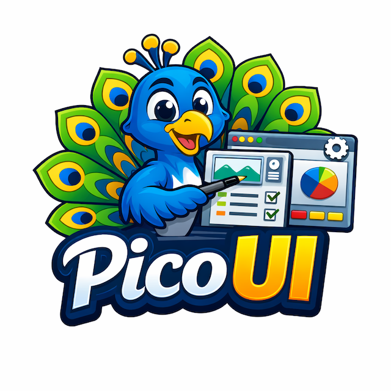

<div align="center">



# PicoUI

**A lightweight, focused UI library for Python**

[](https://opensource.org/licenses/MIT)
[](https://www.python.org/downloads/)

</div>

---

## Overview

PicoUI provides core UI functionality for PySide6/Qt applications with a clean, type-safe API. Built for developers who need reliable UI components—layout helpers, group boxes, preference dialogs, widget specs, and more—without the bloat. It favors convention over configuration and keeps the surface area small.

## Features

- **Layout helpers** — Create vertical/horizontal layouts, form layouts, and rows with optional stretches and spacing
- **Group builders** — Build `QGroupBox` from labels and content (layouts, widget lists, or definitions)
- **Spec-driven UI** — Dataclass specs for buttons, checkboxes, combos, spinboxes, tabs, and windows to describe UI declaratively
- **Preferences dialogs** — Base class for tabbed preference dialogs with spec-driven fields, reset support, and tooltips
- **Widget utilities** — Button/checkbox creation from specs, spinbox-with-label helpers, and value setters
- **Icon registry** — Centralized icon definitions and retrieval with fallback support (qtawesome)
- **Tooltip manager** — Shared tooltip handling
- **Dimensions** — Standard sizes for icons, dialogs, and progress bars

## Requirements

- **Python** 3.8+
- **PySide6**
- **qtawesome** (for icon registry)

## Installation

```bash
pip install picoui
```

Or from source (editable):

```bash
git clone https://github.com/markxbrooks/PicoUI.git
cd PicoUI
pip install -e .
```

## Quick Start

```python
from PySide6.QtWidgets import QApplication, QLabel
from picoui.helpers import build_group, group_with_layout

app = QApplication([])

# Simple group with widgets
group = build_group("Options", [QLabel("Item 1"), QLabel("Item 2")])

# Group with layout for incremental building
group, layout = group_with_layout(label="Section", vertical=True)
layout.addWidget(QLabel("Dynamic content"))

# Layout helpers
from picoui.helpers import create_vertical_layout, create_form_layout
vbox = create_vertical_layout(spacing=8)
form = create_form_layout()
```

## Project Structure

```
picoui/
├── helpers/        # Layout and group box utilities
├── specs/          # Dataclass specs for widgets (ButtonSpec, CheckBoxSpec, etc.)
├── dialogs/        # Preferences dialog base and helpers
├── widget/         # Widget creation helpers and setters
├── tooltip/        # Tooltip management
├── dimensions.py   # Standard UI dimensions
├── icons.py        # Icon registry
└── settings.py     # Settings integration
```

## License

This project is licensed under the MIT License - see the [LICENSE](LICENSE) file for details.

---

<div align="center">

Made with ❤️ for the UI community

</div>
